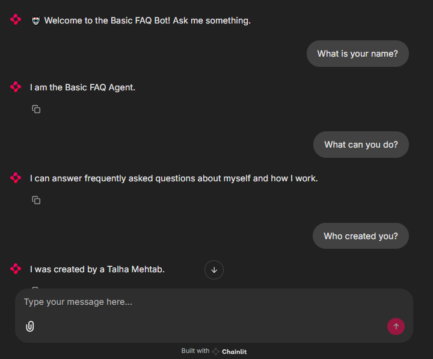
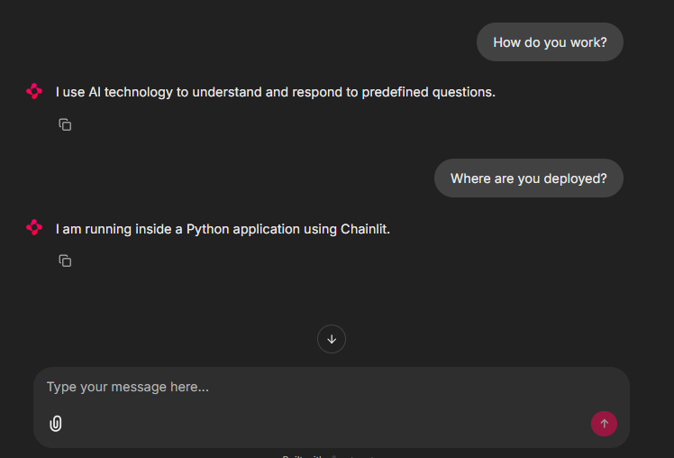

# 🤖 Assignment 1: Basic FAQ Agent

This project demonstrates the creation of a simple FAQ chatbot agent using the **OpenAI Agent SDK** and **Chainlit**. The agent is capable of responding to a predefined set of frequently asked questions.

---

## 🎯 Objective

Build a basic agent that:

- Responds to common, predefined questions.
- Greets the user on start.
- Does not rely on external APIs or dynamic tools.
- Demonstrates use of the `Agent`, `Runner`, and model setup with Chainlit.

---

## 🧠 Agent Behavior

- The agent introduces itself as a helpful FAQ bot.
- It uses a system prompt to keep answers consistent.
- It handles basic questions like:
  - What is your name?
  - What can you do?
  - Who created you?
  - How can you help me?
  - What is AI?

---

## 📋 Example Questions

You can ask:

- What is your name?
- Who built you?
- What can you do?
- How do you work?
- What is AI?

---

## 📸 Screenshots

### ➤ Welcome Message


### ➤ Answering a Question



## 🚀 How to Run

### Step 1: Install requirements (if needed)
```bash
uv pip install -r requirements.txt
