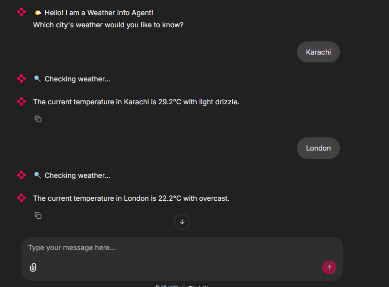

# 🌤️ Assignment 3: Weather Info Agent (Tool Calling)

This project implements a weather assistant agent using the **OpenAI Agent SDK**, **Chainlit**, and **WeatherAPI.com**. The agent responds to weather-related queries by fetching real-time data using a registered Python tool function.

---

## 🎯 Objective

- Build an AI agent that responds to natural language questions about the weather.
- Integrate a tool that fetches weather data using an external API.
- Ensure the agent **uses the tool** for all weather-related responses.

---

## 🔧 Tools & Technologies

- **Chainlit** for chatbot UI
- **OpenAI Agent SDK**
- **WeatherAPI.com** for live weather data
- **Python tool registration** with `@function_tool` decorator

---

## 🛠️ Tool Function

```python
get_weather

## 📸 Screenshots

