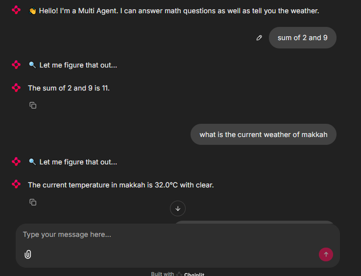

# 🧠 Assignment 4: Agent with Multiple Tools

This project showcases an AI agent capable of answering **both math and weather questions** using separate tools, built using the **OpenAI Agent SDK** and **Chainlit**.

---

## 🎯 Objective

Build an AI agent that:

- Uses the `add(a, b)` and `multiply(a, b)` tools for math questions.
- Uses the `get_weather(city)` tool to fetch weather data.
- Automatically selects the appropriate tool based on the user’s input.

---

## 📸 Screenshots

### ➤ Answering a Question

